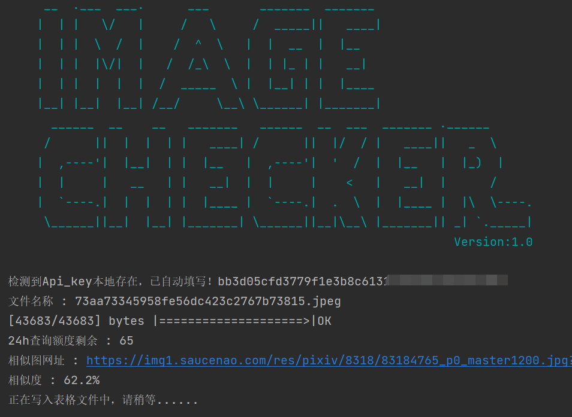
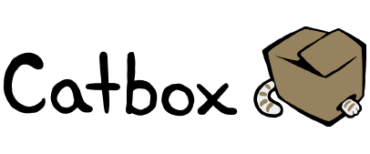

<p align="center">
  <a href="https://github.com/mdjhacker/pyImageChecker">
    
  </a>
</p>

<h1 align="center">PyImageChecker<br>高校网络图像查重系统</h1>


<p align="center">
<a href="https://github.com/mdjhacker/pyImageChecker"></a>
<a href="https://996.icu"></a>
<a href="https://www.neau.edu.cn/"></a>
</p>

## DEMO
<p align="center">


</p>

## 编写理由
高校举办的图片竞选类活动中，存在部分人员直接利用网络图片顶替。传统的人力筛选模式不利于大量图像的筛选。因此利用python进行批量审查，推动原创风气。

## 原理
通过`Catbox`和`Saucenao`的api，先上传到`Catbox`图床，再通过`Saucenao`对回传数据进行分析，输出到`csv`表格中便于对比。

## 已实现功能
- [x] 图片重复率查询
- [x] 重复率表格导出
- [x] API持久化储存
## 安装方法
```
pyupload .gitignore --host=catbox

[1674/1674] bytes |====================>|Your link : https://files.catbox.moe/e03ygs.gitignore
```

## 鸣谢



[PicImageSearch](https://github.com/kitUIN/PicImageSearch)

[Pyupload](https://github.com/yukinotenshi/pyupload)
## TODO
- [ ] 多查询api，增加重复率准确度
## BUG
issue/pull requests
